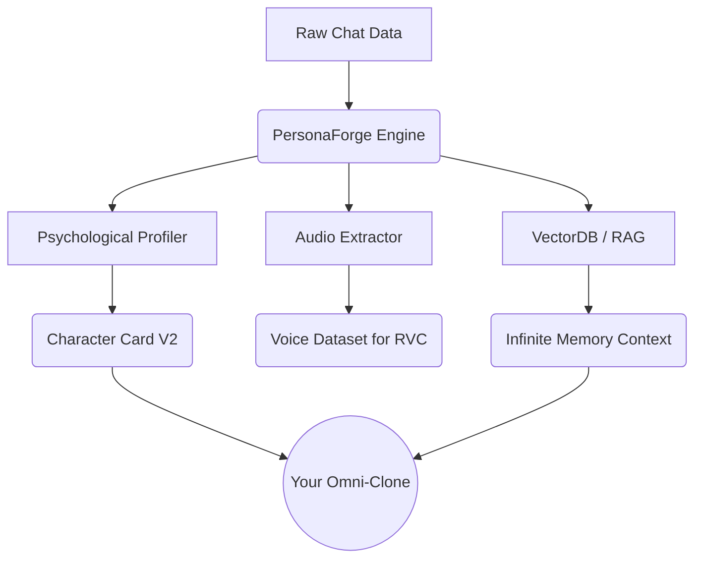

<div align="center">

# 🧬 PersonaForge // OSINT & Digital Necromancy Engine

**Resurrect digital footprints. Forge hyper-realistic AI clones from raw chat history.**

[](https://opensource.org/licenses/MIT)
[](https://www.python.org/downloads/)
[](#infinite-memory-rag)
[](#voice-cloning)

> ⚠️ **DISCLAIMER:** This tool is for research, memorialization, and personal use. Do not clone people without their consent.

[English](#features)

</div>

**PersonaForge** is an open-source, local-first engine that reads your chat histories (WhatsApp, Telegram, Discord) and reverse-engineers the "digital soul" of a person. It extracts their psychological profile, slang, memories, and even their voice, outputting datasets ready for **AI Fine-tuning**, **In-Context Simulation**, or **Roleplay Platforms**.

---

## Features

- **Psychological Profiling**: Uses LLMs to automatically generate a `Character Card V2` detailing the target's Big Five personality traits, catchphrases, and core fears.
- **Infinite Memory (RAG)**: Indexes your *entire* chat history into a local ChromaDB Vector Database. The clone will remember what you said to them 4 years ago.
- **Voice Cloning Pipeline**: Automatically isolates and extracts clean `.ogg` voice notes from Telegram to train ElevenLabs or RVC voice models.
- **Universal Export**: Generate JSONL datasets for OpenAI/Mistral finetuning, or Character Cards for SillyTavern.
- **Omni-Model Integration**: Native support for 100+ LLMs via `litellm` (OpenAI, Anthropic, LLaMA 3, local Ollama).
- **Privacy First**: 100% offline parsing.

---

## Architecture



## 🚀 1-Click God Mode (Resurrection)

Want it all instantly? Use the `resurrect` command. It will parse the chat, extract the psychological profile, vectorize the memory into ChromaDB, and drop you into a **Cyberpunk Terminal UI** chat seamlessly.

```bash
export OPENAI_API_KEY="sk-..."
python main.py resurrect --app whatsapp --file chat.txt --target "John" --model "gpt-4-turbo"
```

---

## 🛠️ Modular Commands

If you want to run steps manually:

### 1. Extract the Persona
```bash
python main.py parse --app whatsapp --file chat.txt --target "John" --output john.jsonl
```

### 2. Extract Psychological Profile (Digital Soul)
```bash
python main.py profile --dataset john.jsonl --model "gpt-4-turbo"
```

### 3. Build Infinite Memory (ChromaDB)
```bash
python main.py memory --dataset john.jsonl
```

### 4. Talk to the Clone (with RAG Memory)
Experience the new `Rich` powered Terminal UI.
```bash
python main.py chat --dataset john.jsonl --model "gpt-4-turbo" --use-memory
```
