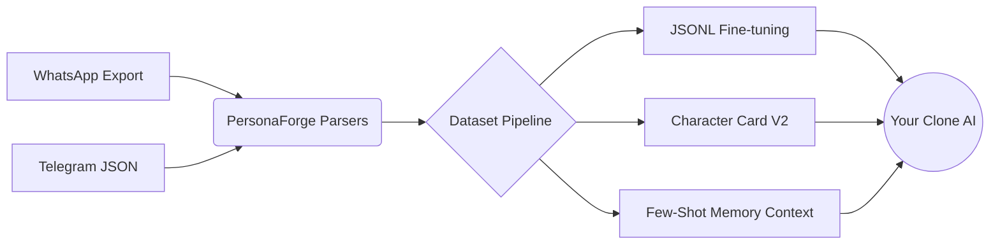

<div align="center">

# 🧬 PersonaForge

**Resurrect digital footprints. Forge AI clones from your chat history.**

[](https://opensource.org/licenses/MIT)
[](https://www.python.org/downloads/)
[](https://github.com/psf/black)
[](http://makeapullrequest.com)

[English](#features) • [Italiano](#come-funziona-italiano)

</div>

**PersonaForge** is an open-source, local-first engine that reads your chat histories (WhatsApp, Telegram, Discord, etc.) and reverse-engineers the "digital soul" of a person. It extracts their tone, slang, common memories, and behavior, outputting datasets ready for **AI Fine-tuning**, **In-Context Simulation**, or **Character Cards** for roleplay platforms.

---

## 🌟 Why PersonaForge?

- 🧬 **Digital Soul Extraction**: More than just parsers. It analyzes speech patterns and contextual memories.
- 🎭 **Universal Export**: Generate JSONL datasets for OpenAI/Mistral finetuning, or **Character Cards (V2)** for SillyTavern and text-generation-webui.
- 🤖 **Omni-Model Integration**: Native support for 100+ LLMs via `litellm` (OpenAI, Anthropic, LLaMA 3, Gemini, local Ollama).
- 🔒 **Privacy First**: 100% offline parsing. Your personal chats never touch external servers until *you* decide to chat with them.

---

## 🏗️ Architecture



## 🚀 Quickstart

### 1. Installation

Clone the repository and install the dependencies. We recommend using a virtual environment or Docker.

```bash
git clone https://github.com/yourusername/persona-forge.git
cd persona-forge
pip install -r requirements.txt
```

### 2. Extract a Persona

Export your chat from WhatsApp (without media) or Telegram (JSON export).

```bash
# Parse the chat and build the cognitive dataset
python main.py parse --app whatsapp --file chat_export.txt --target "John Doe" --output john_dataset.jsonl
```

### 3. Talk to the Clone

Use our built-in terminal UI to talk to the cloned persona via In-Context Learning (no finetuning required!).

```bash
export OPENAI_API_KEY="sk-..."
python main.py chat --dataset john_dataset.jsonl --model "gpt-4-turbo"
```

*Want to run it locally?* Just use `--model "ollama/llama3"`!

---

## roadmap 🗺️

- [x] WhatsApp & Telegram Parsers
- [x] JSONL Generation for Finetuning
- [x] CLI Chat Interface
- [ ] Automated Character Card V2 generation (Personality extraction via LLM)
- [ ] Discord Chat Parser
- [ ] Voice cloning integration (ElevenLabs/XTTS)

---

## 🇮🇹 Come funziona (Italiano)

**PersonaForge** è uno strumento progettato per essere unico e potente: legge gli archivi delle tue app di messaggistica, isola il modo di parlare, le espressioni tipiche e i ricordi della persona bersaglio (target), e ne crea una copia digitale. 

Questo dataset estratto può essere usato in 3 modi:
1. **Fine-Tuning Puro**: Addestrare un modello (es. GPT-4 o LLaMA) in modo che i "pesi" della rete neurale assorbano lo stile della persona.
2. **Character Cards**: Esportare un file di personalità per software come SillyTavern.
3. **In-Context Agent**: Usare la nostra CLI per parlare immediatamente con la copia della persona tramite prompt avanzati (supporta modelli locali e cloud).

Tutto il processamento del testo avviene **in locale**, garantendo la massima privacy per le tue chat.

<div align="center">
<i>Built with ❤️ for the open-source AI community.</i>
</div>
