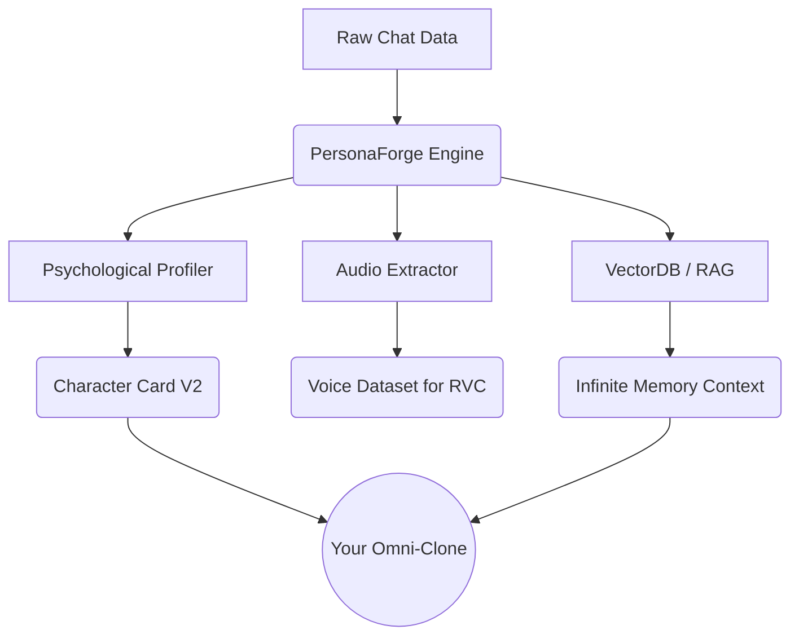

<div align="center">

# 🧬 PersonaForge // OSINT & Digital Necromancy Engine

**Resurrect digital footprints. Forge hyper-realistic AI clones from raw chat history.**

[](https://opensource.org/licenses/MIT)
[](https://www.python.org/downloads/)
[](#infinite-memory-rag)
[](#voice-cloning)

> ⚠️ **DISCLAIMER:** This tool is for research, memorialization, and personal use. Do not clone people without their consent.

[English](#features) • [Italiano](#come-funziona-italiano)

</div>

**PersonaForge** is an open-source, local-first engine that reads your chat histories (WhatsApp, Telegram, Discord) and reverse-engineers the "digital soul" of a person. It extracts their psychological profile, slang, memories, and even their voice, outputting datasets ready for **AI Fine-tuning**, **In-Context Simulation**, or **Roleplay Platforms**.

---

## 🌟 God-Tier Features

- 🧠 **Psychological Profiling**: Uses LLMs to automatically generate a `Character Card V2` detailing the target's Big Five personality traits, catchphrases, and core fears.
- 📚 **Infinite Memory (RAG)**: Indexes your *entire* chat history into a local ChromaDB Vector Database. The clone will remember what you said to them 4 years ago.
- 🎙️ **Voice Cloning Pipeline**: Automatically isolates and extracts clean `.ogg` voice notes from Telegram to train ElevenLabs or RVC voice models.
- 🎭 **Universal Export**: Generate JSONL datasets for OpenAI/Mistral finetuning, or Character Cards for SillyTavern.
- 🤖 **Omni-Model Integration**: Native support for 100+ LLMs via `litellm` (OpenAI, Anthropic, LLaMA 3, local Ollama).
- 🔒 **Privacy First**: 100% offline parsing.

---

## 🏗️ Architecture



## 🚀 Extreme Quickstart

### 1. Extract the Persona & Build Memory
```bash
# 1. Parse the chat
python main.py parse --app whatsapp --file chat.txt --target "John" --output john.jsonl

# 2. Extract Psychological Profile (Digital Soul)
python main.py profile --dataset john.jsonl --model "gpt-4-turbo"

# 3. Build Infinite Memory (ChromaDB)
python main.py memory --dataset john.jsonl

# 4. Extract Voice Notes (If using Telegram)
python main.py voice --file telegram_export.json
```

### 2. Talk to the Clone
Use the built-in terminal UI to talk to the cloned persona.
```bash
export OPENAI_API_KEY="sk-..."
python main.py chat --dataset john.jsonl --model "gpt-4-turbo"
```

---

## 🇮🇹 Come funziona (Italiano)

Abbiamo spinto **PersonaForge** oltre i limiti. Non è solo un estrattore di testo, è un motore di "necromanzia digitale". 
Le nuove feature includono:

1. **Memoria Infinita (RAG)**: Tutto il tuo storico chat viene vettorizzato in un database locale (ChromaDB). Quando parli con il clone, lui andrà a ripescare i ricordi esatti legati a ciò di cui state parlando.
2. **Profilazione Psicologica**: Il comando `profile` scansiona la chat e genera una *Character Card* (JSON) con i tratti della personalità del target (le sue paure, come scrive, le sue catchphrase).
3. **Clonazione Vocale**: Il comando `voice` estrae automaticamente tutti i messaggi vocali dal target isolandoli in una cartella, pronti per essere dati in pasto a ElevenLabs o RVC per clonare la voce reale!
4. **Chat In-Context multi-modello**: Parla con il clone usando LLaMA 3 in locale o GPT-4 in cloud.

**Tutto offline. Tutto privato.**

<div align="center">
<i>Pushing the boundaries of Open-Source AI.</i>
</div>
